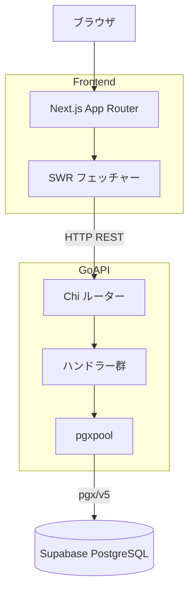
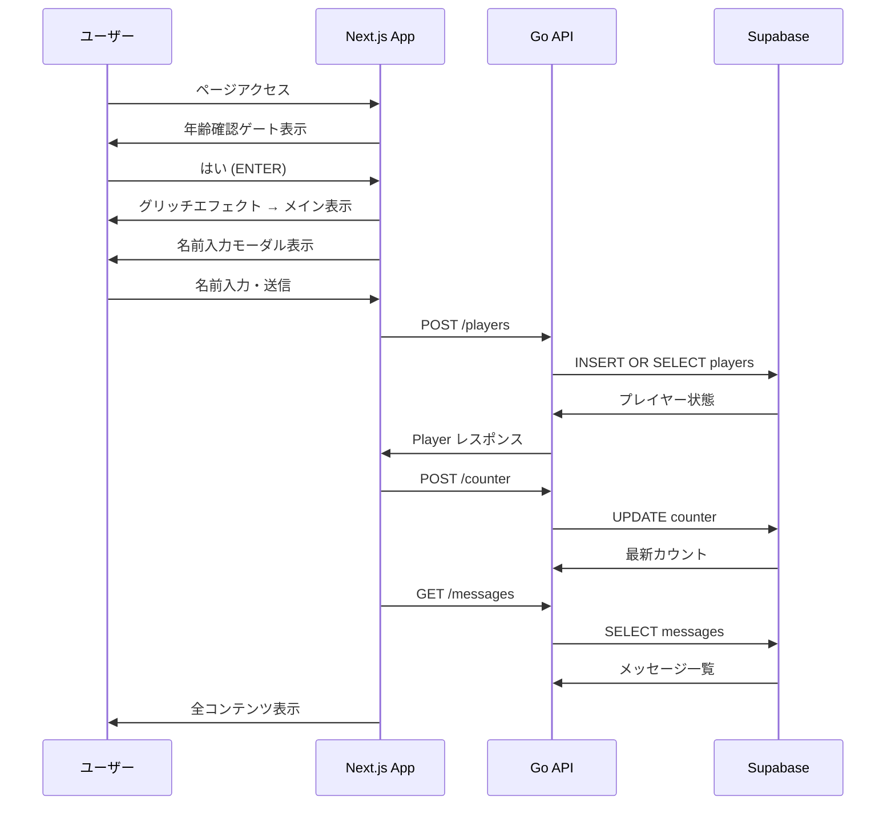
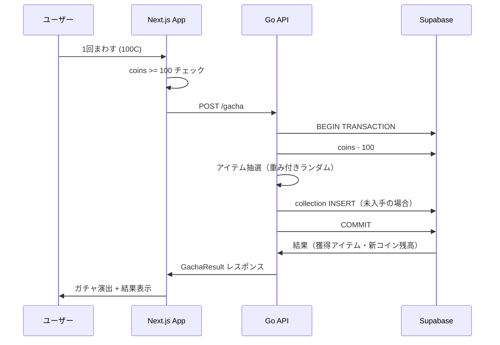

# 技術設計ドキュメント: アクメ漱石 誕生日Webアプリ

## 概要

本システムは「アクメ漱石」の20歳誕生日（2026年4月23日）を祝うファンメイドWebアプリ。  
Next.js App Router のフロントエンドと Go REST API バックエンドを Supabase PostgreSQL で接続する3層構成をとる。  
年齢確認・メッセージ寄せ書き・ガチャ＆コレクション・ミニゲーム連携・アクセスカウンターを提供し、ダーク＆ハッカー美学の一貫したUXを実現する。

### Goals

- モックアップ（`geminimockup.tsx`）の全UIセクションを実装する
- メッセージ・コイン・コレクション・アクセスカウンターをサーバーで永続化する
- ガチャ抽選ロジックをサーバーサイドに閉じ込め、クライアント改ざんを防ぐ

### Non-Goals

- ユーザー認証・ログイン機能（名前ベースの匿名識別のみ）
- `games/typing-game.html` の実装（既存、リンクのみ）
- 管理者用ダッシュボード
- リアルタイム通知（WebSocket / Supabase Realtime）

---

## Boundary Commitments

### This Spec Owns

- `soseki-20th/app/` 配下の全フロントエンドページ・コンポーネント
- `api/` 配下の Go REST API サーバー（全エンドポイント定義とビジネスロジック）
- Supabase 上のデータベーススキーマ（テーブル定義・シード）
- フロント↔API 間の HTTP インターフェース契約

### Out of Boundary

- `games/typing-game.html` の内部実装（別管理）
- Supabase プロジェクトの作成・管理操作（手動セットアップ）
- CI/CD・デプロイパイプライン

### Allowed Dependencies

- `soseki-20th/` の既存 Next.js / Tailwind v4 セットアップ
- Supabase の PostgreSQL 接続 URL（環境変数経由）

### Revalidation Triggers

- API エンドポイントのパス・レスポンス形状を変更した場合、フロントエンドの SWR fetcher を再確認
- `players` テーブルの主キー・一意制約を変更した場合、ガチャ・借金ハンドラーを再確認

---

## アーキテクチャ

### Architecture Pattern & Boundary Map



- **選択パターン**: レイヤードアーキテクチャ（Frontend → API → DB）
- **依存方向**: Frontend → Go API → Supabase。逆方向の依存禁止。
- **ステアリング準拠**: `geminimockup.tsx` のUI構造を踏襲、Tailwind v4 インライン記述、App Router

### Technology Stack

| Layer | 選択 / バージョン | 役割 | 備考 |
|---|---|---|---|
| Frontend | Next.js 16.2.3 / React 19 / TypeScript 5 | UIレンダリング・ルーティング | App Router 使用 |
| スタイリング | Tailwind CSS v4 | UIスタイリング | インラインクラスのみ |
| データフェッチ | SWR 最新版 | API呼び出し・キャッシュ | Vercel 公式推奨 |
| Backend | Go（標準バージョン） | REST API・ガチャロジック | |
| HTTP ルーター | go-chi/chi v5 | ルーティング・ミドルウェア | net/http 互換 |
| CORS | go-chi/cors | CORS 制御 | |
| DB ドライバー | pgx/v5 + pgxpool | PostgreSQL 接続 | Supabase 直接接続 |
| Database | Supabase (PostgreSQL) | データ永続化 | |

詳細な比較・選定根拠は `research.md` を参照。

---

## File Structure Plan

### Directory Structure

```
soseki-hpb-2026/
├── soseki-20th/                     # フロントエンド（既存）
│   ├── app/
│   │   ├── layout.tsx               # 変更: フォント・メタデータ更新
│   │   ├── page.tsx                 # 変更: 全セクションを実装
│   │   └── globals.css              # 変更: アニメーション定義追加
│   ├── components/                  # 新規: UIコンポーネント群
│   │   ├── AgeVerificationGate.tsx  # 年齢確認オーバーレイ
│   │   ├── NameInputModal.tsx       # 名前入力モーダル
│   │   ├── GlobalHeader.tsx         # スティッキーヘッダー + ティッカー
│   │   ├── HeroSection.tsx          # ヒーローセクション
│   │   ├── MessageSection.tsx       # メッセージ一覧 + 投稿フォーム
│   │   ├── MiniGameSection.tsx      # ミニゲームカード
│   │   ├── GachaSection.tsx         # ガチャ + コレクション
│   │   └── FooterCounter.tsx        # アクセスカウンター
│   ├── hooks/                       # 新規: SWR カスタムフック
│   │   ├── usePlayer.ts             # コイン・借金・コレクション取得
│   │   ├── useMessages.ts           # メッセージ一覧取得
│   │   └── useCounter.ts            # アクセスカウンター取得
│   └── lib/
│       └── api.ts                   # 新規: API base URL・fetcher 定義
│
└── api/                             # 新規: Go バックエンド
    ├── cmd/server/
    │   └── main.go                  # エントリーポイント・ルーター設定
    ├── internal/
    │   ├── handler/
    │   │   ├── messages.go          # メッセージ CRUD ハンドラー
    │   │   ├── players.go           # プレイヤー取得・作成ハンドラー
    │   │   ├── gacha.go             # ガチャ実行ハンドラー
    │   │   ├── borrow.go            # 借金ハンドラー
    │   │   └── counter.go           # アクセスカウンターハンドラー
    │   ├── db/
    │   │   └── db.go                # pgxpool 初期化・接続管理
    │   └── model/
    │       ├── message.go           # Message 型定義
    │       ├── player.go            # Player・Collection 型定義
    │       └── item.go              # Item 型定義（レアリティ含む）
    ├── migrations/
    │   └── 001_init.sql             # スキーマ定義 + シードデータ
    ├── go.mod
    └── go.sum
```

### Modified Files

- `soseki-20th/app/page.tsx` — モックアップ相当の全セクションを実装
- `soseki-20th/app/layout.tsx` — メタデータをプロジェクト用に更新
- `soseki-20th/app/globals.css` — ticker・glitch アニメーション定義を追加

---

## System Flows

### 初回訪問フロー



### ガチャ実行フロー



---

## Requirements Traceability

| 要件 | サマリー | コンポーネント | インターフェース | フロー |
|---|---|---|---|---|
| 1.1–1.5 | 年齢確認ゲート | AgeVerificationGate | — | 初回訪問 |
| 2.1–2.5 | ヘッダー・ティッカー | GlobalHeader | — | — |
| 3.1–3.4 | ヒーローセクション | HeroSection | — | — |
| 4.1–4.7 | メッセージ寄せ書き | MessageSection | GET/POST /messages | — |
| 5.1–5.4 | ミニゲームカード | MiniGameSection | — | — |
| 6.1–6.8 | ガチャ・コレクション | GachaSection, NameInputModal | GET /players/:name, POST /gacha, POST /borrow | ガチャ実行 |
| 7.1–7.3 | アクセスカウンター | FooterCounter | POST /counter | 初回訪問 |
| 8.1–8.4 | デザイン・UX | 全コンポーネント | — | — |
| 9.1–9.8 | Go API 全体 | handler/* + db/* + model/* | 全 API エンドポイント | 両フロー |

---

## Components and Interfaces

### コンポーネントサマリー

| コンポーネント | レイヤー | 役割 | 要件カバレッジ | 主要依存（P0/P1） |
|---|---|---|---|---|
| AgeVerificationGate | UI | 年齢確認オーバーレイ | 1.1–1.5 | — |
| NameInputModal | UI | 名前入力・プレイヤー初期化 | 6.1 | usePlayer (P0) |
| GlobalHeader | UI | コイン・借金・ティッカー表示 | 2.1–2.5 | usePlayer (P0) |
| HeroSection | UI | 誕生日ビジュアル | 3.1–3.4 | — |
| MessageSection | UI | メッセージ閲覧・投稿 | 4.1–4.7 | useMessages (P0) |
| MiniGameSection | UI | ゲームカード表示 | 5.1–5.4 | — |
| GachaSection | UI | ガチャ・コレクション | 6.2–6.8 | usePlayer (P0) |
| FooterCounter | UI | アクセスカウンター | 7.1–7.3 | useCounter (P0) |
| usePlayer | Hook | プレイヤー状態管理 | 6.1–6.8 | API /players (P0) |
| useMessages | Hook | メッセージ一覧管理 | 4.1–4.7 | API /messages (P0) |
| useCounter | Hook | カウンター管理 | 7.1–7.3 | API /counter (P0) |
| messages Handler | Go | メッセージ CRUD | 9.1 | db (P0) |
| players Handler | Go | プレイヤー取得・作成 | 9.3, 9.8 | db (P0) |
| gacha Handler | Go | ガチャ抽選・コイン消費 | 9.2 | db (P0) |
| borrow Handler | Go | 借金処理 | 9.3 | db (P0) |
| counter Handler | Go | カウンターインクリメント | 9.4 | db (P0) |

---

### フロントエンド / UI レイヤー

#### AgeVerificationGate

| Field | Detail |
|---|---|
| Intent | 未確認時に全画面オーバーレイを表示し、メインコンテンツへのアクセスをブロックする |
| Requirements | 1.1, 1.2, 1.3, 1.4, 1.5 |

**Responsibilities & Constraints**
- `isVerified` 状態を保持し、false の間は children をレンダリングしない
- グリッチアニメーションは CSS アニメーション + `filter: invert(1) hue-rotate(180deg)`

**Contracts**: State [x]

##### State Management
- State model: `{ isVerified: boolean, showGlitch: boolean }`
- Persistence: sessionStorage に `age_verified` を保存（ページリロード時スキップ）
- Concurrency: なし

**Implementation Notes**
- `globals.css` に `@keyframes glitch` を定義。`animate-glitch` クラスで適用。
- Risks: グリッチ CSS が他コンポーネントに漏れないよう最外 div に閉じ込める。

---

#### NameInputModal

| Field | Detail |
|---|---|
| Intent | 初回訪問時に名前を収集し、プレイヤー状態を API から初期化する |
| Requirements | 6.1 |

**Responsibilities & Constraints**
- `localStorage` に `playerName` を保存。再訪時はモーダルをスキップ。
- 空文字入力はバリデーションで拒否。

**Contracts**: State [x] / API [x]

##### API Contract（呼び出し先）

| Method | Endpoint | Request | Response | Errors |
|---|---|---|---|---|
| POST | /players | `{ name: string }` | `Player` | 400, 500 |

---

#### GlobalHeader

| Field | Detail |
|---|---|
| Intent | コイン残高・借金を常時表示し、ニュースティッカーを流す |
| Requirements | 2.1, 2.2, 2.3, 2.4, 2.5 |

**Responsibilities & Constraints**
- `usePlayer` フックから `coins` / `debt` を受け取る（Props 経由でも可）
- ティッカーテキストは静的定義（ハードコード）

**Contracts**: State [x]

**Implementation Notes**
- `globals.css` に `@keyframes ticker` を定義（`translateX` スクロール）。

---

#### MessageSection

| Field | Detail |
|---|---|
| Intent | メッセージ一覧の横スクロール表示と投稿フォームの管理 |
| Requirements | 4.1, 4.2, 4.3, 4.4, 4.5, 4.6, 4.7 |

**Dependencies**
- Outbound: `useMessages` — メッセージ取得・投稿 (P0)

**Contracts**: API [x] / State [x]

##### Service Interface（useMessages フック）

```typescript
interface UseMessagesResult {
  messages: Message[];
  isLoading: boolean;
  error: Error | null;
  postMessage(input: PostMessageInput): Promise<void>;
}

interface Message {
  id: number;
  author: string;
  text: string;
  createdAt: string;
}

interface PostMessageInput {
  author: string;
  text: string;
}
```

**Implementation Notes**
- Integration: SWR の `mutate` で投稿後に一覧をオプティミスティック更新。
- Validation: `text` が空の場合はクライアントでバリデーション。API エラー時はフォームを維持しエラーメッセージを表示。
- Risks: メッセージ量が増えた場合にページネーション未実装。今回スコープ外。

---

#### GachaSection

| Field | Detail |
|---|---|
| Intent | ガチャ実行・コレクション表示・借金機能を提供する |
| Requirements | 6.2, 6.3, 6.4, 6.5, 6.6, 6.7, 6.8 |

**Dependencies**
- Outbound: `usePlayer` — プレイヤー状態取得・更新 (P0)

**Contracts**: API [x] / State [x]

##### Service Interface（usePlayer フック）

```typescript
interface UsePlayerResult {
  player: Player | null;
  isLoading: boolean;
  error: Error | null;
  spinGacha(): Promise<GachaResult>;
  borrowCoins(): Promise<void>;
}

interface Player {
  name: string;
  coins: number;
  debt: number;
  collection: CollectionItem[];
}

interface CollectionItem {
  itemId: number;
  name: string;
  rarity: 'UR' | 'SSR' | 'R' | 'N';
  icon: string;
  acquired: boolean;
}

interface GachaResult {
  item: CollectionItem;
  isNew: boolean;
  newCoins: number;
}
```

---

### Go API レイヤー

#### messages Handler

| Field | Detail |
|---|---|
| Intent | メッセージの一覧取得と新規投稿を処理する |
| Requirements | 9.1, 4.1, 4.5 |

**Contracts**: API [x]

##### API Contract

| Method | Endpoint | Request Body | Response | Errors |
|---|---|---|---|---|
| GET | /api/messages | — | `[]Message` | 500 |
| POST | /api/messages | `{ author, text }` | `Message` | 400, 500 |

- Preconditions: `author`・`text` は空文字不可（API レベルでバリデーション）
- Postconditions: POST 成功時 201 を返す

---

#### players Handler

| Field | Detail |
|---|---|
| Intent | プレイヤーの取得・作成を処理する（名前ベースの upsert） |
| Requirements | 9.3, 9.8, 6.1 |

**Contracts**: API [x]

##### API Contract

| Method | Endpoint | Request Body | Response | Errors |
|---|---|---|---|---|
| GET | /api/players/:name | — | `Player` | 404, 500 |
| POST | /api/players | `{ name }` | `Player` | 400, 500 |

- POST は「初回は INSERT、既存は SELECT」の upsert 動作（`ON CONFLICT DO NOTHING`）
- 初回プレイヤーには初期コイン 100 を付与

---

#### gacha Handler

| Field | Detail |
|---|---|
| Intent | コイン消費・アイテム抽選・コレクション更新をトランザクション内で実行する |
| Requirements | 9.2, 6.3, 6.4 |

**Contracts**: API [x]

##### API Contract

| Method | Endpoint | Request Body | Response | Errors |
|---|---|---|---|---|
| POST | /api/gacha | `{ player_name }` | `GachaResult` | 400, 402, 500 |

- `402 Payment Required`: コイン残高 < 100
- トランザクション内で: coins -= 100 → 抽選 → collection INSERT
- 抽選重み: UR=1, SSR=4, R=20, N=75（合計100）

---

#### borrow Handler

| Field | Detail |
|---|---|
| Intent | コイン +100、借金 +100 を更新する |
| Requirements | 9.3, 6.5 |

**Contracts**: API [x]

##### API Contract

| Method | Endpoint | Request Body | Response | Errors |
|---|---|---|---|---|
| POST | /api/players/:name/borrow | — | `{ coins, debt }` | 404, 500 |

---

#### counter Handler

| Field | Detail |
|---|---|
| Intent | アクセスカウンターをインクリメントして最新値を返す |
| Requirements | 9.4, 7.1 |

**Contracts**: API [x]

##### API Contract

| Method | Endpoint | Request Body | Response | Errors |
|---|---|---|---|---|
| POST | /api/counter | — | `{ count: number }` | 500 |

- アトミックな `UPDATE counter SET count = count + 1 RETURNING count`

---

### データアクセスレイヤー

#### db パッケージ

| Field | Detail |
|---|---|
| Intent | pgxpool の初期化・接続管理を担う共有インフラ |
| Requirements | 9.5, 9.6 |

**Contracts**: Service [x]

```go
// DB はアプリ全体で共有するコネクションプール
type DB struct {
    Pool *pgxpool.Pool
}

func New(ctx context.Context, databaseURL string) (*DB, error)
func (d *DB) Close()
```

- Supabase 接続文字列は環境変数 `DATABASE_URL` から取得
- `pgxpool.Config` でコネクション最大数を設定（推奨: 5）
- Supabaseへの接続が失敗した場合、起動時にフェイルファストで終了し、リクエスト中の失敗は 503 を返す

---

## Data Models

### Domain Model

```
Player（集約ルート）
├── name: string（自然キー）
├── coins: int
├── debt: int
└── collection: CollectionItem[]

Message（独立集約）
├── id: int
├── author: string
└── text: string

Item（静的マスターデータ）
├── id: int
├── name: string
├── rarity: UR | SSR | R | N
├── icon: string
└── weight: int（ガチャ重み）

AccessCounter（シングルトン集約）
└── count: int
```

### Physical Data Model

```sql
-- プレイヤー
CREATE TABLE players (
    id         SERIAL PRIMARY KEY,
    name       TEXT UNIQUE NOT NULL,
    coins      INTEGER NOT NULL DEFAULT 100,
    debt       INTEGER NOT NULL DEFAULT 0,
    created_at TIMESTAMPTZ DEFAULT NOW()
);

-- メッセージ
CREATE TABLE messages (
    id         SERIAL PRIMARY KEY,
    author     TEXT NOT NULL,
    text       TEXT NOT NULL,
    created_at TIMESTAMPTZ DEFAULT NOW()
);

-- アイテムマスター（シードデータ）
CREATE TABLE items (
    id     SERIAL PRIMARY KEY,
    name   TEXT NOT NULL,
    rarity TEXT NOT NULL CHECK (rarity IN ('UR','SSR','R','N')),
    icon   TEXT NOT NULL,
    weight INTEGER NOT NULL
);

-- コレクション（プレイヤーとアイテムの多対多）
CREATE TABLE collections (
    player_name TEXT NOT NULL REFERENCES players(name),
    item_id     INTEGER NOT NULL REFERENCES items(id),
    acquired_at TIMESTAMPTZ DEFAULT NOW(),
    PRIMARY KEY (player_name, item_id)
);

-- アクセスカウンター（シングルトン）
CREATE TABLE access_counter (
    id    INTEGER PRIMARY KEY DEFAULT 1,
    count INTEGER NOT NULL DEFAULT 0,
    CONSTRAINT single_row CHECK (id = 1)
);
INSERT INTO access_counter VALUES (1, 0);
```

**インデックス**:
- `players(name)` — UNIQUE 制約により自動
- `collections(player_name)` — プレイヤーのコレクション取得

### Data Contracts & Integration

**APIデータ転送形式**: JSON（`Content-Type: application/json`）

フロントエンド側の型は `lib/api.ts` に集約して定義。Go 側の `model/*.go` と 1:1 対応させる。

---

## Error Handling

### Error Strategy

- **Go API**: エラーは JSON `{ "error": "message" }` 形式で返す。5xx はログ出力後にクライアントには詳細を隠蔽。
- **フロントエンド**: SWR の `error` 状態を各コンポーネントが受け取り、インライン表示。

### Error Categories and Responses

| カテゴリ | 例 | API レスポンス | UI 表示 |
|---|---|---|---|
| ユーザーエラー (400) | 空文字メッセージ投稿 | `400 { error: "text required" }` | フォーム下にエラー文 |
| コイン不足 (402) | ガチャコイン不足 | `402 { error: "insufficient coins" }` | 不足メッセージ表示 |
| DB 障害 (503) | Supabase 接続失敗 | `503 { error: "service unavailable" }` | 「サーバーに接続できません」トースト |

### Monitoring

- Go API はリクエストごとに `method path status latency` をログ出力（Chi の標準 middleware）
- Supabase 側は Dashboard のビルトインモニタリングを利用

---

## Testing Strategy

### Unit Tests

- `gacha.go` の抽選ロジック（重み付きランダム、レアリティ分布検証）
- `model/*.go` の型バリデーション関数
- `AgeVerificationGate` の状態遷移（グリッチ→確認完了）

### Integration Tests

- `POST /api/gacha` エンドポイント: コイン消費・コレクション更新の整合性
- `POST /api/messages` → `GET /api/messages` の往復確認
- `POST /api/players`（新規・既存）の upsert 動作

### E2E Tests

- 初回訪問フロー: 年齢確認 → 名前入力 → コンテンツ表示
- ガチャフロー: コイン消費 → 演出 → コレクション反映
- メッセージ投稿: フォーム送信 → 一覧末尾に追加

---

## Security Considerations

- `DATABASE_URL` は環境変数から取得し、コードにハードコードしない
- API は特定オリジン（`ALLOWED_ORIGIN` 環境変数）のみ CORS 許可
- メッセージ・名前の入力は最大長バリデーション（name: 50文字、message: 500文字）でDB 注入を防止
- pgx のパラメータバインディングを使用し SQL インジェクションを防止
