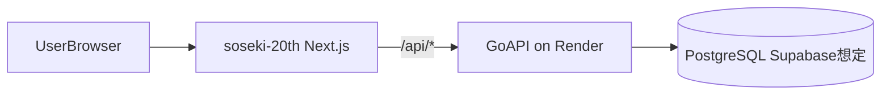

# soseki-hpb-2026

友達の生誕企画向けの Web アプリケーションです。  
フロントエンド（Next.js）とバックエンド API（Go）を組み合わせ、寄せ書き・ミニゲーム・ガチャなどの体験を提供します。

## システム構成

- Frontend: `soseki-20th`（Next.js 16 / React 19 / TypeScript）
- Backend API: `api`（Go 1.26）
- Deployment: Frontend は Vercel、API は Render（`render.yaml`）



## ディレクトリ構成

- `soseki-20th`: メインアプリ（画面、UI、ミニゲーム、SWR 経由の API 通信）
- `api`: プレイヤー、メッセージ、ゲーム結果、ランキング等を扱う API
- `games`: 静的ゲーム資産（補助コンテンツ）
- `render.yaml`: Render デプロイ設定

## 技術スタック

- Frontend: Next.js, React, TypeScript, Tailwind CSS, SWR
- Game/UI: matter-js, poly-decomp, lucide-react
- Testing: Vitest, Testing Library, Playwright, ESLint
- Backend: Go, chi, pgx

## セットアップ

前提:

- Node.js（推奨: 20 系）
- npm
- Go 1.26
- PostgreSQL（Supabase 含む）

## クイックスタート

API とフロントをそれぞれ別ターミナルで起動します。

### 1) API を起動

```bash
cd api
cp .env.example .env
# .env の DATABASE_URL を実環境に合わせて編集
go run ./cmd/server
```

### 2) Frontend を起動

```bash
cd soseki-20th
npm install
npm run dev
```

ブラウザで `http://localhost:3000` にアクセスします。

## 環境変数

### API（`api/.env`）

`api/.env.example` をベースに設定します。

- `DATABASE_URL`（必須）: PostgreSQL 接続文字列
- `ALLOWED_ORIGIN`（任意）: CORS 許可オリジン（未設定時 `http://localhost:3000`）
- `PORT`（任意）: API ポート（未設定時 `8080`）

### Frontend（`soseki-20th/.env.local`）

- `NEXT_PUBLIC_API_URL`: API ベース URL（未設定時 `http://localhost:8080`）
- `NEXT_PUBLIC_UI_MOCK`: `true` で UI モック有効
- `NEXT_PUBLIC_YOSEGAKI_BOARD`: `true` で寄せ書きボード表示切替
- `NEXT_PUBLIC_SHOW_VIDEO`: `true` で動画セクション表示
- `SECRET_WORD`: 設定時に合言葉ゲートを有効化

## ローカル開発コマンド

### Frontend（`soseki-20th`）

```bash
npm run dev
npm run build
npm run start
npm run lint
npm run test
npm run test:e2e
```

初回 E2E 実行時は必要に応じて以下を実行してください。

```bash
npx playwright install
```

### Backend（`api`）

```bash
go test ./...
```

## デプロイ

- Frontend: `soseki-20th/vercel.json` で `/api/*` を Render 側 API へ rewrite
- Backend: ルート `render.yaml` で `api` サービスを定義

本番では、Render 側 `ALLOWED_ORIGIN` を Vercel の公開 URL に合わせて設定してください。

## 主要機能メモ

- 合言葉ゲート（`SECRET_WORD` 設定時）
- 寄せ書き投稿・編集・表示
- ミニゲーム起動とランキング反映
- ガチャとコレクション体験

## トラブルシュート

- API が起動しない: `DATABASE_URL` が未設定の可能性があります
- すぐ `/gate` へ遷移する: `SECRET_WORD` が設定されている可能性があります
- フロントから API 接続できない: `NEXT_PUBLIC_API_URL` と CORS 設定を確認してください
- E2E が失敗する: `npx playwright install` を実行してください